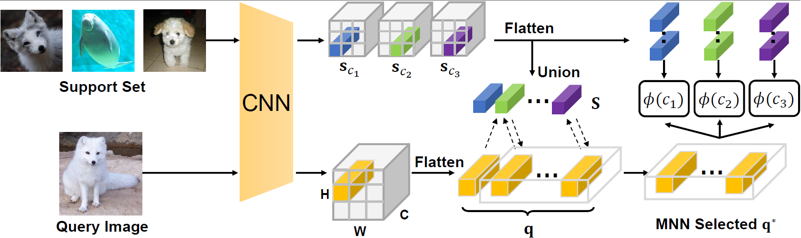

# DMN4: Few-shot Learning via Discriminative Mutual Nearest Neighbor Neural Network

The code repository for "DMN4: Few-shot Learning via Discriminative Mutual Nearest Neighbor Neural Network" in pytorch. If you use any content of this repo for your work, please cite the following bib entry:

    @inproceedings{liu2021fewshot}

If you have any question regarding the paper, please send a email to **lyng_95@zju.edu.cn**

## Abstract

In this work, we argue that a Mutual Nearest Neighbor (MNN) relation should be established to explicitly select the query descriptors that are most relevant to each task and discard the duplicate ones in FSL. Specifically, we propose **Discriminative Mutual Nearest Neighbor Neural Network (DMN4)** for FSL. Extensive experiments demonstrate that our method not only qualitatively selects task-relevant descriptors but also quantitatively outperforms the existing state-of-the-arts by a large margin of 6.5~9.7% on finegrained CUB, a considerable margin of ~3% on both supervised and semi-supervised miniImagenet, and ~1.4% on challenging tieredimagenet.

## Few-shot classification Results

Experimental results on few-shot learning datasets with **Conv4/ResNet-12/WRN-28-10** backbones. We report average results with 6,000 randomly sampled episodes for both 1-shot and 5-shot evaluation.

**MiniImageNet**

|          | 5-way 1-shot (**Conv4**) | 5-way 5-shot (**Conv4**) |5-way 1-shot (**ResNet12**) | 5-way 5-shot (**ResNet12**) |
|:----------------------:|:------------:|:------------:|:------------:|:------------:|
|       MatchingNet      |     43.56    |     55.31    |     63.08    |     75.99    |
|        ProtoNet        |     49.42    |     68.20    |    59.25    |     75.60    |
|       RelationNet      |     50.44    |     65.32    |   61.40    |     77.00    |
|           DSN          |     51.78    |     68.99    |   62.64    |     78.83    |
|         DeepEMD        |     52.15    |     65.52    |  65.91    |     82.41    |
|          **DN4**       |     **54.33**|     **71.99**|  **64.84**|     **77.74**|
|          **MN4**       |     **55.57**|     **73.64**|  **65.53**|     **78.23**|
|          **DMN4**      |     **55.77**|     **74.22**|  **65.71**|     **80.16**|

|          | 5-way 1-shot (WRN-28-10) | 5-way 5-shot (WRN-28-10) |
|:--------:|:------------------------:|:------------------------:|
|    PPA   |           59.60          |           73.74          |
| wDAE-GNN |           61.07          |           76.75          |
|    LEO   |           61.76          |           77.59          |
|   FEAT   |           65.10          |           81.11          |
|  **DN4** |         **63.68**        |         **80.32**        |
|  **MN4** |         **66.43**        |         **82.84**        |
| **DMN4** |         **66.29**        |         **82.80**        |

**TieredImageNet**

| | 5-way 1-shot (**Conv4**) | 5-way 5-shot (**Conv4**) |5-way 1-shot (**ResNet12**) | 5-way 5-shot (**ResNet12**) |
|:----------------------:|:------------:|:------------:|:------------:|:------------:|
|       MatchingNet      |     -    |     -    |     68.50    |     80.60    |
|        ProtoNet        |     53.31    |     72.69    |    65.65    |     83.40    |
|       RelationNet      |     54.48    |     71.32    |   58.99    |     75.78    |
|           DSN          |     53.22    |     71.06    |   67.39    |     82.85    |
|         DeepEMD        |     50.89    |     65.52    |  71.16    |     86.03    |
|          **DN4**       |     **56.02**|     **71.96**|  **69.60**|     **83.41**|
|          **MN4**       |     **57.01**|     **72.32**|  **71.80**|     **84.52**|
|          **DMN4**      |     **56.99**|     **74.13**|  **72.59**|     **85.24**|

**Caltech-UCSD Birds-200-2011**

| | 5-way 1-shot (**Conv4**) | 5-way 5-shot (**Conv4**) |5-way 1-shot (**ResNet12**) | 5-way 5-shot (**ResNet12**) |
|:----------------------:|:------------:|:------------:|:------------:|:------------:|
|       MatchingNet      |     61.16    |     72.89    |     71.87    |     85.08    |
|        ProtoNet        |     58.43    |     75.22    |    66.09    |     82.50    |
|       RelationNet      |     62.45    |     76.11    |   64.47    |     77.45    |
|           DSN          |     63.21    |     85.68    |   75.17    |     89.81    |
|         DeepEMD        |     68.68    |     82.80    |  75.65    |     88.69    |
|          **DN4**       |     **73.42**|     **90.38**|  **82.58**|     **90.08**|
|          **MN4**       |     **78.10**|     **92.14**|  **82.63**|     **90.43**|
|          **DMN4**      |     **78.36**|     **92.16**|  **82.95**|     **90.46**|

## Prerequisites

The following packages are required to run the scripts:

- [PyTorch >= version 1.1](https://pytorch.org)

## Dataset

### MiniImageNet Dataset

It contains 100 classes with 600 images in each class, which are built upon the ImageNet dataset. The 100 classes are divided into 64, 16, 20 for meta-training, meta-validation and meta-testing, respectively.

### TieredImageNet Dataset
TieredImageNet is also a subset of ImageNet, which includes 608 classes from 34 super-classes. Compared with  miniImageNet, the splits of meta-training(20), meta-validation(6) and meta-testing(8) are set according to the super-classes to enlarge the domain difference between  training and testing phase. The dataset also include more images for training and evaluation (779,165 images in total).

### Caltech-UCSD Birds-200-2011 Dataset
Caltech-UCSD Birds-200-2011 (CUB) was originally proposed for fine-grained bird classification, which contains 11,788 images from 200 classes divided into 100, 50 and 50 for meta-training, meta-validation and meta-testing, respectively.

## Model Training and Evaluation

We put several `*.yaml` examples in `./configs/*/` directory and can be used to fast train and test different methods by running (assume using device 0):

    $ sh ./fast_train_test.sh ./configs/*/*.yaml 0

Also, it can be run separately by **training**:

    $ python experiments/run_trainer.py --cfg ./configs/*/*.yaml --device 0

and run **evaluation** by

    $ python experiments/run_evaluator.py --cfg ./configs/*/*.yaml -c ./checkpoint/*/*.pth --device 0

We also provide configs for **distributed training** (4GPU for WRN-28-10)

    $ python -m torch.distributed.launch --nproc_per_node=4 ./experiments/run_distributed_trainer \
    --cfg ./configs/*/*.yaml -w 4

and **semi-supervised few-shot learning** tasks (with trial `t=1`).

    $ python experiments/run_semi_trainer.py \
    --cfg ./configs/miniImagenet/MN4_N5K1_semi_with_extractor.yaml --device 0 -t 1

    $ python experiments/run_semi_evaluator.py \
    --cfg ./configs/miniImagenet/MN4_N5K1_semi_with_extractor.yaml -c ./checkpoints/*/*.pth --device 0

## Acknowledgment
The reimplementation results of DeepEMD and DSN reported in our project are from the following repos.

- [DeepEMD](https://github.com/icoz69/DeepEMD)

- [DSN](https://github.com/chrysts/dsn_fewshot)

Also, many appreciate to the excellent work provide by [@WenbinLee](https://github.com/WenbinLee) for inspiration.

- [DN4](https://github.com/WenbinLee/DN4)