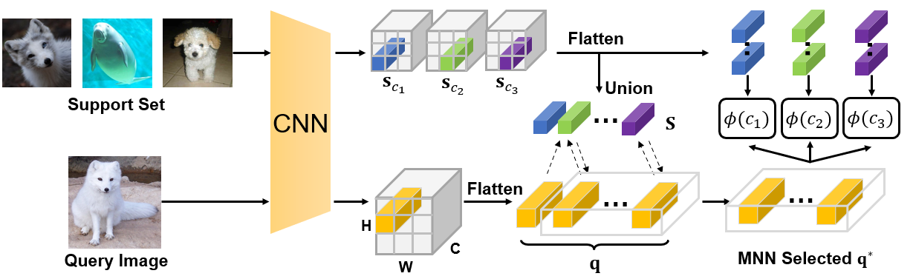

# DMN4: Few-shot Learning via Discriminative Mutual Nearest Neighbor Neural Network

The code repository for "DMN4: Few-shot Learning via Discriminative Mutual Nearest Neighbor Neural Network" in pytorch. If you use any content of this repo for your work, please cite the following bib entry:

    @inproceedings{liu2021fewshot}

If you have any question regarding the paper, please send a email to **lyng_95@zju.edu.cn**

## Abstract

In this work, we argue that a Mutual Nearest Neighbor (MNN) relation should be established to explicitly select the query descriptors that are most relevant to each task and discard the duplicate ones in FSL. Specifically, we propose **Discriminative Mutual Nearest Neighbor Neural Network (DMN4)** for FSL. Extensive experiments demonstrate that our method not only qualitatively selects task-relevant descriptors but also quantitatively outperforms the existing state-of-the-arts by a large margin of 6.5 $\sim$ 9.7% on finegrained CUB, a considerable margin of $\sim$ 3% on both supervised and semi-supervised miniImagenet, and $\sim$ 1.4% on challenging tieredimagenet.

## Few-shot classification Results

Experimental results on few-shot learning datasets with Conv4/ResNet-12/WRN-28-10 backbones. We report average results with 6,000 randomly sampled episodes for both 1-shot and 5-shot evaluation.

**MiniImageNet Dataset**

|     Conv4 Backbone     | 5-way 1-shot | 5-way 5-shot |
|:----------------------:|:------------:|:------------:|
|       MatchingNet      |     43.56    |     55.31    |
|        ProtoNet        |     49.42    |     68.20    |
|       RelationNet      |     50.44    |     65.32    |
|           DSN          |     51.78    |     68.99    |
|         DeepEMD        |     52.15    |     65.52    |
|          **DN4**       |     **54.33**|     **71.99**|
|          **MN4**       |     **55.57**|     **73.64**|
|          **DMN4**      |     **55.77**|     **74.22**|

|     ResNet12 Backbone  | 5-way 1-shot | 5-way 5-shot |
|:----------------------:|:------------:|:------------:|
|       MatchingNet      |     63.08    |     75.99    |
|        ProtoNet        |     59.25    |     75.60    |
|       RelationNet      |     61.40    |     77.00    |
|           DSN          |     62.64    |     78.83    |
|         DeepEMD        |     65.91    |     82.41    |
|          **DN4**       |     **64.84**|     **77.74**|
|          **MN4**       |     **65.53**|     **78.23**|
|          **DMN4**      |     **65.71**|     **80.16**|